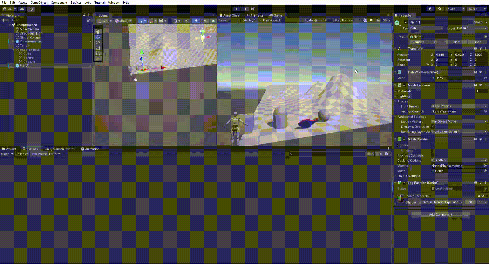

# Introducción a Unity

El script emplea el método _Debug.Log()_ y accede a la propiedad _position_ del _transform_ del gameObject (transform.position).

El script debe ser asociado a cada gambeObject para que se muestre su posición por consola.

